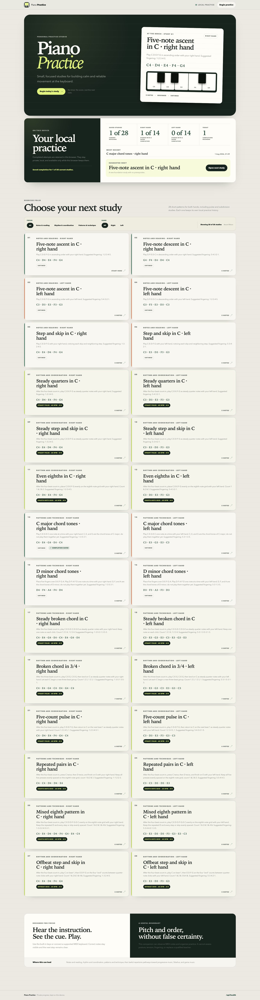

# Piano Practice

Piano Practice is a personal, local-first browser application for focused piano exercises, with a thin native wrapper for dependable MIDI input on iPad. The current vertical slice offers eight original beginner studies: six untimed right- and left-hand C-position patterns plus one steady-quarter study for each hand. Each study includes a server-rendered treble or bass pitch guide, immediate deterministic pitch, order, and bounded timing feedback, and completed-attempt history in the current browser or web view.

The application runs as a Cloudflare Worker through Wrangler. It renders useful HTML on the server, then progressively enhances the practice page with small typed browser modules. There is no client framework, account, cloud database, generative feedback loop, percentage grade, or streak mechanic.

## Current Practice Slice

- Choose from eight canonical exercises on the home or practice page, even when JavaScript or MIDI is unavailable.
- Open `/practice` for the default right-hand ascent, or use `?exercise=<id>` to link directly to another exercise.
- Read the current natural-note sequence on a pitch-only staff guide: treble for the right-hand C4-G4 studies and bass for the left-hand C3-G3 studies. Ordered note text remains alongside it as the accessible fallback.
- Use the five on-screen practice keys for a deterministic hardware-free flow.
- On a supported desktop browser, select and connect a Web MIDI input.
- On iPadOS 17 or later, use the native wrapper to select one USB or paired Bluetooth CoreMIDI source.
- See the next expected note, accepted notes, active notes, and calm feedback for correct, repeated, out-of-order, and wrong input.
- For either steady-quarter study, choose 40–100 BPM (60 by default), hear a four-beat 4/4 count-in and quarter-note click, and receive on-pulse, early, or late feedback after the first correct note anchors the attempt.
- Restart cleanly after a disconnect or whenever you want to begin again.
- Keep compact completed-attempt history scoped to each exercise ID and revision in a versioned `localStorage` record. Timed completions may include their tempo, interval classifications, and mean absolute error; incomplete and interrupted attempts are not saved.

The staff guide supports gradual pitch-position reading, but its markers do not encode note duration or a complete score, and MIDI completion cannot establish that the learner read it. MIDI can confirm note pitch and order for every exercise and assess onset intervals for the steady-quarter studies. It cannot verify which hand played, assess posture, tension, fingering, note duration, velocity quality, or touch, or replace a qualified piano teacher.

## Run Locally

Local development and local CI target macOS.

1. Run `nvm use` to select the Node.js version pinned in `package.json` and mirrored in `.nvmrc`.
2. Run `npm install`.
3. Run `npm run dev`.
4. Open `http://127.0.0.1:8787` or go directly to `http://127.0.0.1:8787/practice`.

`npm run build` compiles Tailwind CSS and the typed browser entry point into ignored public assets under `.generated/browser/`. Wrangler runs this build automatically for local development and deployment.

## Input Support

The on-screen input is always the deterministic fallback and is also used by browser tests. Web MIDI is available only where the browser exposes the API and the learner grants access; real-device behavior still depends on the browser, operating system, and keyboard connection.

Ordinary iPad Safari is not treated as a reliable direct MIDI runtime. The `ios/LearnPiano.xcodeproj` wrapper hosts the same deployed HTTPS application in WKWebView and adapts CoreMIDI through `NativeMidiInputPort`; CoreAudioKit provides the system Bluetooth MIDI pairing interface. Native, Web MIDI, and mock events all reach the same exercise, evaluation, session, and persistence code. Native completions are identified as `native-midi` attempts.

## Run On iPad

The native target requires Xcode on macOS and supports iPadOS 17 or later. It uses only Apple frameworks; no Capacitor or native plugin dependency is required.

1. Deploy the Worker to an HTTPS URL that the iPad can reach.
2. Open `ios/LearnPiano.xcodeproj` in Xcode and select the `LearnPiano` scheme.
3. Configure signing and choose a physical iPad target.
4. On first launch, enter the deployed application URL. The `LEARN_PIANO_APP_URL` build setting can provide an initial `LearnPianoAppURL` value in the app's Info.plist instead.
5. Build and run, then choose a USB MIDI source or open the system Bluetooth MIDI pairing interface and select the paired source.

The wrapper restricts main-frame navigation and native bridge messages to the configured origin. HTTPS is required outside validated local-development hosts. Signing, provisioning, deployment, and real USB/Bluetooth device verification remain operator steps; simulator builds do not validate MIDI hardware.

## Architecture

- `src/worker.ts` is the Worker entry point and top-level router.
- `src/views/` renders the home, practice, and fallback documents.
- `src/client/` owns browser composition, session orchestration, DOM projection, and local persistence.
- `src/audio/` owns the guidance-only Web Audio count-in and steady-pulse scheduler.
- `src/notation/` owns the dependency-free pitch-to-staff projection for the current supported guide subset.
- `src/midi/` defines the platform-neutral input contract plus Web MIDI and deterministic mock adapters.
- `ios/` contains the iPadOS 17+ WKWebView shell, CoreMIDI service, CoreAudioKit pairing UI, and Swift tests.
- `src/exercises/` contains the validated canonical exercise model and deterministic evaluator.
- `src/api/` contains the JSON health endpoint used by tooling and smoke tests.
- Colocated `*.test.ts` files cover domain and integration behavior; colocated `*.e2e.ts` files cover browser-visible flows.

Each canonical exercise definition is the shared source for rendering, evaluation, fixtures, and persisted identity. The reversible inline-SVG pitch-guide adapter derives its supported treble and bass positions from the same expected events without adding notation fields, schema versions, or exercise revisions. Live evaluation is local and replayable: an identical exercise, selected tempo, and normalized MIDI sequence always yield the same result. Timed studies compare accepted-note MIDI timestamp deltas with canonical beat gaps; their Web Audio count-in and metronome guide the learner but are never used as evaluation timestamps.

## Routes

- `GET /` — application overview and eight-exercise beginner library
- `GET /practice` — the default right-hand C4-to-G4 ascent
- `GET /practice?exercise=<id>` — a selected canonical exercise; unknown IDs return `404`
- `GET /styles.css` and `GET /client/*.js` — generated same-origin browser assets
- `GET /api/health` — stable JSON health response

## Verification

- `npm run quality:gate:fast` — formatting, lint, types, browser-code guard, tooling tests, dependency audit, and unit coverage
- `npm run quality:gate` — the baseline gate plus Playwright browser tests
- `npm run ci:local` — the containerized GitHub Actions workflow for workflow-sensitive or full-readiness changes
- `npm test` — colocated Vitest unit and integration tests
- `npm run e2e` — Playwright browser tests
- `npm run typecheck` — TypeScript 7 project checks
- `npm run build` — stylesheet and browser ESM build
- `npm run ios:build` — unsigned generic iOS Simulator build
- `npm run ios:build-for-testing` — unsigned generic iOS Simulator build-for-testing
- `npm run mutation` — full local mutation test run

The repo-managed pre-push hook runs affected-file guardrails after `npm install`. Install the pinned Playwright browser with `npm run playwright:install` when needed. See `docs/development.md` for the complete workflow, Agent CI setup, and write boundaries.

## Documentation Contract

The repo vendors ASDLC reference material under `.asdlc/`. Repo-specific truth lives in `ARCHITECTURE.md`, `specs/`, and `docs/adrs/`: generated code still has to implement those documents, and passing CI alone is not sufficient.

- Development and local CI: `docs/development.md`
- Architecture decisions: `docs/adrs/README.md`
- Living feature specs: `specs/README.md`
- Agent rules: `AGENTS.md`
- Reusable capability kits: `.capabilities/`
- Portable template maintenance packs: `.template/updates/`

The application screenshot is committed at `docs/screenshots/home.png` and refreshed manually after material UI changes; screenshot capture is not part of CI.

## Next Slice

Possible next slices include a deterministic next-study recommendation or another small original rhythm pattern. Full score notation, note duration, velocity, rests, eighth notes, syncopation, chords, hands-together work, adaptive tempo, protected repertoire content, cloud sync, and iPad release distribution remain separate decisions.
